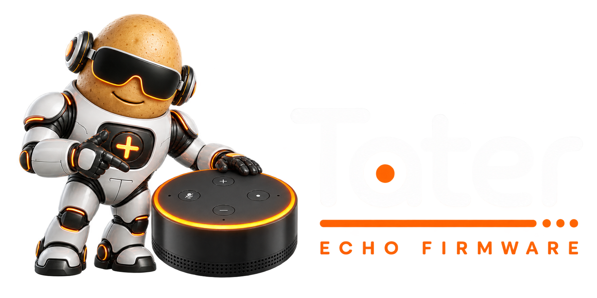

<p align="center">
  
</p>

<p align="center">
  <a href="https://taterassistant.com">
    
  </a>
  <a href="https://discord.gg/w52namKyXT">
    
  </a>
</p>

<p align="center">
  <a href="https://github.com/TaterTotterson/Tater-Echo-Firmware/actions/workflows/ci.yml"></a>
  <a href="https://github.com/TaterTotterson/Tater-Echo-Firmware/releases"></a>
  <a href="LICENSE"></a>
</p>

Tater Echo Firmware turns supported rooted Amazon Echo hardware into a native
Tater voice satellite. Wake detection, audio capture, playback, LEDs, device
controls, and the Tater satellite protocol all run on the Echo—no Home
Assistant or EchoMuse controller is required.

The repository is arranged for multiple Echo models. Each target has its own
factory path while sharing the Tater-native protocol and release format.

| Target | Device | Unlock base | Status | Factory | OTA |
|---|---|---|---|---:|---:|
| `biscuit` | Echo Dot 2nd Generation (2016) | amonet-biscuit v2.0.0 | Hardware tested | Yes | Yes |
| `checkers` | Echo Show 5 1st Generation (2019) | amonet-checkers v2.0.1+ | Screen/bring-up preview | Screen only | Not yet |

Machine-readable target data lives in [`targets/targets.json`](targets/targets.json).

## Features

- On-device microWakeWord with live wake-word/model changes from Tater.
- Wake audio upload for the trainer and optional second-STT wake verification.
- User-selected wake sounds, including bundled defaults that work offline.
- Tater-controlled LED animations, including a full-ring `Audio Glow` that
  follows real reply audio, confidence-calibrated seven-mic direction-of-arrival,
  reply direction held toward the speaker, and per-microphone echo-canceller
  state for clean beam switches.
- ESP-parity action-button controls: hold for push-to-intercom; press five
  times, then hold the sixth press for five seconds to return to setup mode.
- Continued conversation/reopen-mic, barge-in, synchronized stereo/group media
  playback, disk-backed streaming, rate-slew/rejoin correction, synchronized
  TTS overlays and audio scenes, local music ducking, volume,
  mute, timers, and announcements.
- BLE presence advertisements for Tater's room-level presence system, plus
  one-shot phone/watch enrollment with automatic bond cleanup.
- First-boot Wi-Fi and Tater pairing portal—no browser USB wizard required.
- SHA-256 verified A/B OTA with automatic userspace rollback after fast crashes.
- A lightweight Checkers screen APK with live listening, thinking, reply/DOA,
  media, timer, mute, volume, and push-to-intercom surfaces.

See [`docs/tater-native-port.md`](docs/tater-native-port.md) for the protocol,
runtime layout, and detailed validation notes.

## Install on an Echo Dot 2

First complete the
[amonet-biscuit v2.0.0 unlock, FireOS 6 flash, and root steps](https://xdaforums.com/t/unlock-root-twrp-unbrick-amazon-echo-dot-2nd-gen-2016-biscuit.4761416/).
Then:

1. Boot the Echo into TWRP (white LED ring) and connect USB.
2. Download the latest `tater-echo-biscuit-*-factory.tar.gz` archive from the
   [latest release](https://github.com/TaterTotterson/Tater-Echo-Firmware/releases/latest).
   In a terminal, extract the archive, enter the extracted folder, and run the
   installer:

   ```bash
   tar -xzf tater-echo-biscuit-v*-factory.tar.gz
   cd tater-echo-biscuit-v*-factory
   ./install.sh
   ```

3. After reboot, join the `Tater-Setup-XXXX` Wi-Fi network and use the captive
   page to select Wi-Fi and pair the satellite with Tater.

The host only needs Python 3 and `adb`. The script refuses to proceed unless it
sees TWRP and the Biscuit A/B partition layout, asks for an explicit `INSTALL`
confirmation, verifies the release manifest, reads both boot slots, and reads
back every partition write before rebooting.

The archive contains **no Amazon kernel or device trees**. It builds the final
emOS image on your computer from the attached Echo's own stock boot partition.
A private recovery image is stored under `factory-backups/`, and stock remains
in `boot_b`. Never publish that backup; it contains code from your device.

Installer details and recovery options are in
[`factory/biscuit/README.md`](factory/biscuit/README.md).

## First-stage Echo Show 5 testing

The Checkers target currently provides the reversible screen and hardware
bring-up stage. It requires amonet 2.0.1 or newer, working TWRP, and rooted
stock Fire OS 6. Run this stage before replacing Fire OS so the profiler can
record Amazon's original audio routing and microphone topology. Extract
`tater-echo-checkers-<version>-factory.tar.gz`, connect USB, and run:

```bash
./install.sh --profile
```

The script installs and launches Tater Show as the HOME app, then creates a
redacted, read-only hardware profile. It does not write any partition or start
the native audio service. That service stays gated until Checkers' real ALSA
routes and microphone channel map have been measured from the first unit.
Details and recovery commands are in
[`factory/checkers/README.md`](factory/checkers/README.md).

## Releases

An annotated `vX.Y.Z` tag builds two artifacts for each supported model:

| Artifact | Purpose |
|---|---|
| `tater-echo-biscuit-vX.Y.Z-factory.tar.gz` | Complete post-amonet installation and recovery bundle |
| `tater-echo-biscuit-vX.Y.Z-ota.bin` | Device-independent Tater userspace update over Wi-Fi |
| `tater-echo-checkers-vX.Y.Z-factory.tar.gz` | Guarded Checkers screen installer and hardware profiler |
| `tater-echo-checkers-vX.Y.Z-screen-preview.apk` | Standalone signed developer-preview screen APK |
| `firmware-manifest.json` | Target, compatibility, file sizes, and SHA-256 hashes |
| `SHA256SUMS` | Human/tool verification of every release artifact |

The same build also publishes the exact BusyBox source and license inside the
factory archive. GitHub's Actions artifact is produced for manual workflow
runs; pushing an annotated version tag additionally creates a GitHub Release.

Example:

```bash
git tag -a v0.1.0 --cleanup=verbatim
git push origin v0.1.0
```

The tag annotation becomes the release notes. See
[`docs/firmware-releases.md`](docs/firmware-releases.md) for the artifact and
OTA contract.

## OTA status

The hardware-tested Biscuit firmware is ready for Tater-managed OTA. Tater sends an
`ota.url` command containing the release URL, SHA-256, and size. The Echo:

1. downloads to the inactive `server_a`/`server_b` slot;
2. verifies the exact size, SHA-256, and ELF header;
3. atomically switches the active symlink and restarts; and
4. rolls back after three fast startup failures.

Tater resolves this repository's `firmware-manifest.json`, selects the artifact
matching the Echo's `biscuit` target, and sends the existing OTA command. Echo
updates therefore appear alongside the other native-satellite updates in the
Tater application. Checkers advertises `ota: false` until the native service,
APK signing identity, and coordinated APK/service rollback have passed hardware
testing.

## Development

Build the device firmware with the pinned Android compiler image:

```bash
docker build -t echomuse-compiler device/compiler/
cd device
./compile.sh
./build_microwakeword_runtime.sh
./test_microwakeword_runtime.sh
```

Run the Go and installer regression tests:

```bash
cd device && go test -race ./internal/actionbutton ./internal/taternative ./internal/wakeword/microwakeword ./internal/beamformer ./internal/server
cd .. && python3 -m unittest factory.biscuit.test_install factory.checkers.test_install tools.test_merge_release_manifests
./screen/gradlew -p screen :app:assembleDebug
```

Release builds run in GitHub Actions because emOS also needs pinned static ARM
builds of `init32`, `wpa_supplicant`, and BusyBox.

## Adding another Echo model

Add target metadata to [`targets/targets.json`](targets/targets.json), a
target-specific installer under `factory/<codename>/`, its release build job,
and hardware-backed partition/boot tests. Do not assume another Echo shares
Biscuit's partition map, kernel architecture, LED controller, microphone
topology, or recovery procedure.

## Upstream and license

This project is derived from [EchoMuse](https://github.com/wilbowes/EchoMuse)
and preserves its Git history. EchoMuse supplied the mature Biscuit hardware
support, emOS boot tooling, and recovery-safe A/B userspace deployment that the
Tater-native implementation builds on. The `upstream` Git remote remains the
original project so relevant hardware fixes can be reviewed and merged.

Credit also goes to R0rt1z2 for amonet-biscuit, Binozo for EchoGo and
GoTinyAlsa, Dragon863 for EchoCLI, the microWakeWord and TensorFlow Lite
Micro projects, Xiph.Org for SpeexDSP, and every EchoMuse contributor and
hardware tester.

The repository is [MIT licensed](LICENSE), with third-party terms documented
in [NOTICE.md](NOTICE.md). BusyBox is GPL-2.0; each factory release includes
the exact corresponding source, license, and build script. Amazon, Echo, Echo
Dot, Alexa, and FireOS are trademarks of Amazon.com, Inc. or its affiliates.
This project is independent and is not affiliated with or endorsed by Amazon.
