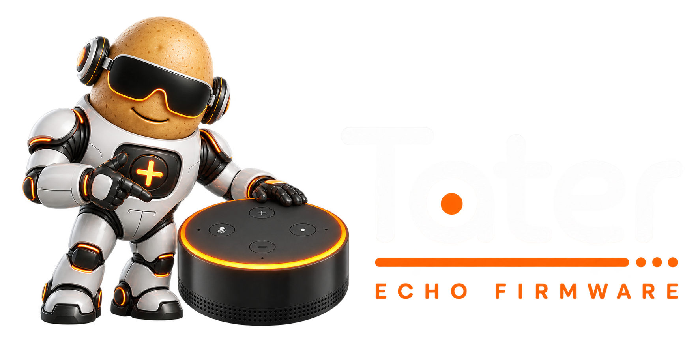

<p align="center">
  
</p>

<p align="center">
  <a href="https://taterassistant.com"></a>
  <a href="https://discord.gg/w52namKyXT"></a>
</p>

<p align="center">
  <a href="https://github.com/TaterTotterson/Tater-Echo-Firmware/actions/workflows/ci.yml"></a>
  <a href="https://github.com/TaterTotterson/Tater-Echo-Firmware/releases"></a>
  <a href="LICENSE"></a>
</p>

Tater Echo Firmware turns supported, unlocked Amazon Echo hardware into native
Tater voice satellites. Wake detection, audio processing, playback, displays,
controls, Bluetooth, and OTA updates run directly on the Echo. Home Assistant
and a separate Echo controller are not required.

## Supported devices

Only the exact generations and codenames below are supported. Do not use an
installer on a similar-looking Echo from another generation.

| Device | Target | Required unlock | Installed system | Factory | OTA |
|---|---|---|---|---:|---:|
| Echo Dot 2nd Generation (2016) | `biscuit` | amonet-biscuit v2.0.0 | Tater emOS | Yes | Yes |
| Echo 2nd Generation (2017) | `radar` | amonet-radar v1.0.0 | Tater emOS | Experimental | Experimental |
| Echo Show 5 1st Generation (2019) | `checkers` | amonet-checkers v2.0.1+ | Tater Linux | Yes | Yes |
| Echo Spot 1st Generation (2017) | `rook` | amonet-rook v2.0.0 | Tater Linux | Yes | Yes |

Target metadata used by Tater and the release builds lives in
[`targets/targets.json`](targets/targets.json).

## Features

- On-device microWakeWord, openWakeWord, or Dual Wake Word detection, with
  built-in and custom models managed from Tater.
- Hardware-appropriate microphone processing and beamforming: seven
  microphones on Biscuit and Radar, two on Checkers, and four on Rook.
- Continued conversation, barge-in, intercom, timers, announcements, wake
  sounds, mute, volume, and wake-audio training samples.
- Sendspin multi-room and stereo-pair playback with synchronized PCM/FLAC,
  native TTS overlays, audio scenes, music ducking, and persistent output
  channel selection.
- Tater-controlled Biscuit/Radar LED animations and complete native Checkers
  and Rook display experiences for weather, timers, notifications, Room
  Vision, music, and live tool status.
- Passive BLE advertisement forwarding for room-level presence.
- Secure active BLE GATT connections for services such as Meshtastic Core,
  including PIN pairing, persistent bonds, notifications, and unpairing.
- Captive-portal Wi-Fi and Tater pairing, followed by verified A/B OTA updates
  with automatic rollback.

## Install Biscuit — Echo Dot 2

Start with an Echo Dot 2nd Generation (`biscuit`) that has completed the
[amonet-biscuit v2.0.0 unlock, Fire OS 6 flash, and root procedure](https://xdaforums.com/t/unlock-root-twrp-unbrick-amazon-echo-dot-2nd-gen-2016-biscuit.4761416/).

1. Boot the Echo into TWRP—the ring should be white—and connect USB.
2. Download `tater-echo-biscuit-<version>-factory.tar.gz` from the
   [latest release](https://github.com/TaterTotterson/Tater-Echo-Firmware/releases/latest).
3. Extract the archive and run its installer:

   ```bash
   tar -xzf tater-echo-biscuit-v*-factory.tar.gz
   cd tater-echo-biscuit-v*-factory
   ./install.sh
   ```

4. After reboot, join `Tater-Setup-XXXX` and complete the setup page.

The computer needs Python 3 and `adb`. The installer validates the device and
both boot slots, builds emOS from that Echo's own stock boot image, preserves
stock in `boot_b`, verifies every write, and saves a private recovery image in
`factory-backups/`. Never publish that backup. See the
[`factory/biscuit` guide](factory/biscuit/README.md) for recovery details.

## Install Radar — Echo 2

Radar support is experimental. Start with the 2017 full-size Echo 2
(`radar`, model XC56PY) after completing the
[amonet-radar v1.0.0 unlock, Fire OS 6 dual-slot flash, and root procedure](https://xdaforums.com/t/unlock-root-twrp-unbrick-amazon-echo-2nd-gen-2017-radar.4801290/).
The device has no external USB socket; keep normal power connected and use the
D+, D-, and GND pads documented in that guide.

1. Boot TWRP using the method documented by the amonet-radar unlock guide.
   Radar does not provide a dependable hold-button shortcut for recovery.
2. Download and extract `tater-echo-radar-<version>-factory.tar.gz`.
3. Verify, then install the bundle:

   ```bash
   ./install.sh --verify-bundle
   ./install.sh
   ```

4. After reboot, join `Tater-Setup-XXXX` and complete setup.

The installer uses Radar's own Fire OS 6 kernel and device trees, preserves
stock in `boot_b`, and resolves the canonical `boot_a`/`boot_b` slots after
amonet restores the GPT rather than selecting stale `_x` aliases. Keep the
private recovery backup and USB connection available while this target remains
experimental.

From a normal emOS boot, the USB-console command `/init recovery` is the
dependable route back to TWRP.

See the [`factory/radar` guide](factory/radar/README.md) for details.

## Install Checkers — Echo Show 5

Start with an unlocked Echo Show 5 **1st Generation** (`checkers`),
amonet-checkers 2.0.1 or newer, and working TWRP. The
[Checkers unlock guide](https://xdaforums.com/t/unlock-root-twrp-unbrick-amazon-echo-show-5-1st-gen-2019-checkers.4762900/)
covers those prerequisites.

1. Download and extract `tater-echo-checkers-<version>-factory.tar.gz` from the
   [latest release](https://github.com/TaterTotterson/Tater-Echo-Firmware/releases/latest).
2. Boot Checkers into TWRP. Connect a USB **data** cable and keep external
   power connected.
3. Verify the bundle, then run the conversion:

   ```bash
   ./install.sh --verify-bundle
   ./install.sh
   ```

4. On first boot, join `Tater-Setup-XXXX` and complete the setup page.

This factory conversion reformats userdata and turns the former system
partition into an A/B Tater Linux store. It preserves TWRP and recovery
backups, downloads only the pinned and checksum-verified LineageOS driver
source, and never boots LineageOS. Routine updates are OTA afterward. See the
[`factory/checkers-linux` guide](factory/checkers-linux/README.md) for Windows,
USB provisioning, checksum, and recovery instructions.

## Install Rook — Echo Spot

Start with an unlocked 2017 Echo Spot **1st Generation** (`rook`),
amonet-rook v2.0.0, and working TWRP.

1. Download and extract `tater-echo-rook-<version>-factory.tar.gz` from the
   [latest release](https://github.com/TaterTotterson/Tater-Echo-Firmware/releases/latest).
2. Boot Rook into TWRP. Connect USB while keeping normal power connected.
3. Verify the bundle and device without writing anything:

   ```bash
   ./install.sh --verify-bundle
   ./install.sh --preflight-only
   ```

4. Run `./install.sh` and type `ERASE` only after checking the displayed model
   and partition information. Keep both cables connected until first-boot
   checks finish.
5. Join the `Tater-Setup-XXXX` network shown on the Spot and complete setup.

The conversion creates an A/B Tater Linux store, preserves TWRP, and saves
private recovery backups. It uses only the pinned and checksum-verified Rook
LineageOS package as a source for hardware drivers; LineageOS is not booted.
See the [`factory/rook-linux` guide](factory/rook-linux/README.md) for complete
prerequisites, Windows commands, reinstall rules, and recovery steps.

## Updates and release files

After factory installation, use Tater's normal satellite updater. Biscuit and
Radar switch their inactive userspace slot; Checkers and Rook stage their
daemon and native display together in A/B application slots. A failed health
check rolls back to the preceding working slot.

| Release file | Use |
|---|---|
| `tater-echo-biscuit-vX.Y.Z-factory.tar.gz` | Complete Biscuit installation or recovery |
| `tater-echo-biscuit-vX.Y.Z-ota.bin` | Biscuit OTA update |
| `tater-echo-radar-vX.Y.Z-factory.tar.gz` | Experimental Radar installation or recovery |
| `tater-echo-radar-vX.Y.Z-ota.bin` | Experimental Radar OTA update |
| `tater-echo-checkers-vX.Y.Z-factory.tar.gz` | Complete Checkers USB conversion |
| `tater-echo-checkers-vX.Y.Z-ota.tar.gz` | Checkers application OTA |
| `tater-echo-rook-vX.Y.Z-factory.tar.gz` | Complete Rook USB conversion |
| `tater-echo-rook-vX.Y.Z-ota.tar.gz` | Rook application OTA |
| `firmware-manifest.json` | Version, compatibility, filename, size, and SHA-256 metadata used by Tater |

An annotated `vX.Y.Z` tag builds all four targets and publishes the shared
manifest and checksums. See [`docs/firmware-releases.md`](docs/firmware-releases.md)
for the complete release and OTA contract.

## Development

Build and test the emOS firmware targets and native wake runtime:

```bash
docker build -t tater-echo-compiler device/compiler/
cd device
./compile.sh
TATER_FIRMWARE_TARGET=radar ./compile.sh
./build_microwakeword_runtime.sh
./test_microwakeword_runtime.sh
go test -race ./internal/... ./pkg/...
```

Checkers and Rook release builds also compile their native screen, camera, wake
runtime, and complete Linux rootfs in GitHub Actions.

Technical references:

- [`docs/tater-native-port.md`](docs/tater-native-port.md) — native protocol,
  Bluetooth, runtime layout, and OTA behavior
- [`docs/biscuit-hardware.md`](docs/biscuit-hardware.md) — measured Biscuit
  audio hardware
- [`docs/radar-hardware.md`](docs/radar-hardware.md) — live Radar partition,
  audio, privacy, and factory-build measurements
- [`factory/radar/README.md`](factory/radar/README.md) — experimental Radar
  install and recovery contract
- [`docs/checkers.md`](docs/checkers.md) — Checkers hardware and native Linux
  integration
- [`linux/rook/README.md`](linux/rook/README.md) — Rook hardware and native
  Linux integration
- [`docs/listening.md`](docs/listening.md) — bounded on-device private listening
- [`docs/led-ring-states.md`](docs/led-ring-states.md) — Biscuit LED behavior
- [`porting/README.md`](porting/README.md) — adding another Echo model

## Credits and license

This project builds on open-source work from
[EchoMuse](https://github.com/wilbowes/EchoMuse) by Wil Bowes,
[TECHO5](https://github.com/HuskerMinion/techo5) by HuskerMinion, and
[TECHO5 Spot](https://github.com/HuskerMinion/techo5-spot) by HuskerMinion.
Their retained licenses and full attribution are recorded in [`NOTICE.md`](NOTICE.md).

Additional credit goes to R0rt1z2 for amonet-biscuit and amonet-radar,
Vithurshan Selvarajah and Yuri Gelfand for the hardware-tested echolocal Radar
path, Binozo for EchoGo and GoTinyAlsa, Dragon863 for EchoCLI, and the
microWakeWord, openWakeWord, Microsoft ONNX Runtime, TensorFlow Lite Micro,
Xiph.Org, and hardware-testing communities.

Tater Echo Firmware is [MIT licensed](LICENSE), with third-party terms recorded
in [`NOTICE.md`](NOTICE.md). Factory releases include the matching BusyBox
source, license, and build script. This project is independent and is not
affiliated with or endorsed by Amazon.
